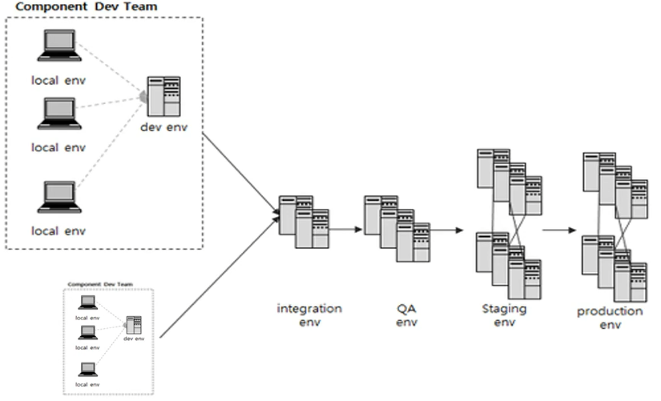
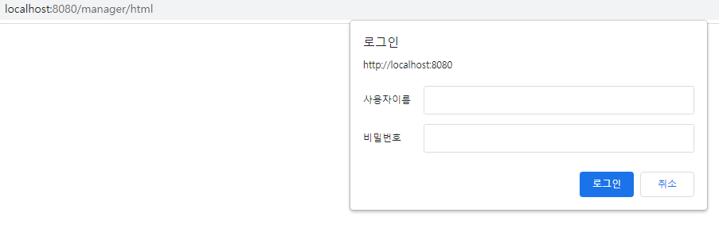
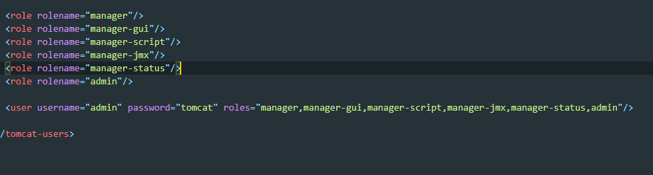
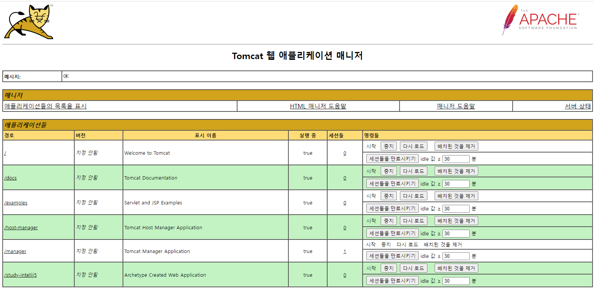
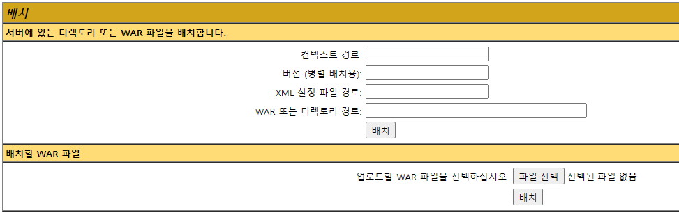
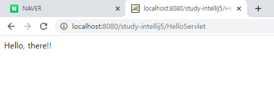

# study IntelliJ

이곳은 IntelliJ IDEA의 사용법을 익히기 위한 저장소입니다. 이 프로젝트를 통해 얻고자 하는 지식은 다음과 같습니다.

1. Maven 을 통한 Java Web Project 빌드 방법
2. Tomcat Server를 IntelliJ IDEA에 연동하는 방법

학습은 인프런의 [웹 애플리케이션 개발을 위한 IntelliJ IDEA 설정](https://www.inflearn.com/course/%EC%9D%B8%ED%85%94%EB%A6%AC%EC%A0%9C%EC%9D%B4-%EC%9B%B9%EC%95%B1/dashboard) 을 통해 진행했습니다.

---

### 서버 개발 환경
내가 지금 학습하고 있는 개념을 인지하자. "웹 애플리케이션 개발을 위한 서버 개발 환경 설정"이다. 이를 명확히 인지했으면 시선을 조금 떨어트려서 큰 그림을 바라보자. 이 개념이 속한 상위집합을 보는 것이다.

"서버 개발"은 크게 두 개의 집합으로 구분할 수 있다. "개발 환경"과 "운영 환경"이다.

* 개발 환경: 실제 프로그램을 개발하기 위한 환경. 구현, 배포, 테스트, 형상관리까지의 과정을 의미한다. 
* 운영 환경: 개발과 테스트가 완료된 프로그램을 "서비스"하기 위한 환경.

이를 그림으로 확인하자.

Component Dev Team
* Local : 각 컴퓨터의 개발환경
* Dev : 로컬환경에서 만든 코드를 하나로 합친 환경. 각각 개발자들이 나눠서 만들었던 모듈에 대해 테스트.
---
* Integration : 데브환경이 여러개 있을때 통합. 없을수도 있다.
* QA : 개발환경에서 완료된 코드를 테스트환경으로 배포한 뒤 테스트 진행.
* Staging : 운영환경과 거의 동일한 환경 구축. 이후에 운영환경으로 이전하기 전, 비기능적 테스트 실행.
* Production : 실제 서비스를 운영하는 환경

경우에 따라 Local - QA - Production 환경만 구축해놓은 경우도 있음.

만들었던 개발 환경을 다음단계로 넘기기 위해 Package형태로 만든다. 서버가 하나라면 수작업으로 가능하지만 여러개일경우 자동화가 필수다. 이를 CI/CD라한다.

## 운영환경 구축

### maven 빌드와 Tomcat서버 실행

이 실습은 기초중에서도 기초이다. 그렇기에 위에서 서술한 서버 개발의 여러 단계가 생략되어있다. 지금까지 로컬환경에서 작업한 결과물을 바로 마지막 단계인 운영환경으로 끌어와서 서버에 배포할 것이다. 이제 실제로 Maven을 통해 프로젝트를 빌드해보자.

* Maven - Compile: target 디렉토리가 생긴다. 이곳엔 내가 만든 소스코드가 바이트 코드로 들어있다.

* Maven - Package: Compile + Package다. target 디렉토리에 war파일이 생긴다.

여기까지 했으면 이 war파일을 통해 Tomcat Server를 실행시켜보다.

나의 경우 빌드 과정을 통해 study-intellij.war 파일이 생겼다. 이 파일을 Tomcat root - webapps 디렉토리에 붙여넣기하자. 이후에 터미널을 통해 톰캣서버를 실행시키면 localhost:8080 페이지가 뜨는것을 확인할 수 있다.

### Tomcat 오류

원래라면 위의 과정에서 webapp 디렉토리에 study-intellij 라는 디렉토리가 생성됐어야한다. 왜냐, 톰캣서버가 구동되는 동시에 study-intellij.war파일을 압축해제하기 때문이다. 하지만 나는 정상적으로 실행되지 않았다. 원인을 찾아 해결해보자.

    27-Dec-2021 09:33:43.006 INFO [main] org.apache.catalina.startup.HostConfig.deployWAR 웹 애플리케이션 아카이브 [C:\Program Files\develop\apache-tomcat-9.0.56\webapps\study-intellij5.war]을(를) 배치합니다.
    27-Dec-2021 09:33:43.036 SEVERE [main] org.apache.catalina.startup.ContextConfig.beforeStart 컨텍스트 [/study-intellij5]을(를) 위한 docBase를 조정하는 중 예외 발생
    java.io.IOException: 디렉토리 [C:\Program Files\develop\apache-tomcat-9.0.56\webapps\study-intellij5]을(를) 생성할 수 없습니다.

원인: Log를 보면 최상위 디렉토리가 Program Files이다. 나는 여기서 두 가지 가설을 세웠다.

1. 파일 디렉토리에 "공백"이 존재한다. 개발을 하는데 있어서 디렉토리에 공백이 존재하면 예상치 못한 오류를 일으키곤 한다.
2. Program Files에서 파일을 수정/생성하려면 관리자권한이 필요하다.

해결: 위의 가설을 통해 Tomcat의 root디렉토리를 이동시켰더니 해결됐다.

### Tomcat manager 이용

위에서 한 실습을 복습해보자. 

* maven을 이용해 프로젝트를 빌드했다. (package)
* target 폴더에 .war 파일이 생성됐다.
* 생성된 .war파일을 tomcat의 루트 디렉토리 - webapps에 복사, 붙여넣기했다. 이는, 직접 서버에 배포한다는 의미이다.

자, 이번엔 실제 환경에서 이루어지는 웹 어플리케이션 배포에 대해 알아보자. 이를 위해 Tomcat manager를 사용한다.

톰캣 매니저를 사용하기 위해선 users.xml파일을 수정해야한다. 파일을 vsc로 편집하자.

위와 같이 설정한 후, 로그인을 실행하면

이런 창이뜬다. 위에서 보이는 것 중, study-intellij5가 내가 배포한 애플리케이션이다. .war파일을 tomcat - webapps 디렉토리에 직접 복사 - 붙여넣기 한 것이다. 이번엔 서버 배포 과정을 매니저를 통해 해보자.

1. 우선, 이전에 배포했던 study-intellij5 를 제거한다.
2. tomcat - webapps 디렉토리에 폴더가 삭제되었는지 확인한다. 
3. 매니저를 통해 .war를 배치하자. 
4. tomcat - webapps에 정상적으로 .war 파일과 study-intellij5 디렉토리가 생겼는지 확인.
5. 정상적으로 페이지가 뜨는지 확인. 

여기까지 아주 기본적인 개념을 알아보았다. 이를 Recap 해보자.
* Maven을 통한 Project build
* 웹 애플리케이션을 직접 서버에 등록
* 웹 애플리케이션을 매니저를 통해 서버에 등록

여기까지 IntelliJ를 사용한 웹개발 기초에 대해 알아봤다. 